# 🤖 SWE-AGENT: AI Multi-Agent Software Engineering Workflow

[](https://opensource.org/licenses/MIT)
[](https://www.python.org/downloads/)
[](https://nodejs.org/)
[](https://www.docker.com/)

> **An autonomous multi-agent system that automates the entire software engineering workflow from JIRA issue assignment to Pull Request creation.**

SWE-AGENT leverages AI agents, MCP (Model Context Protocol) servers, and modern web technologies to create a complete DevOps automation pipeline that can autonomously handle the full software development lifecycle.

## 🎯 **Overview**

SWE-AGENT is designed to eliminate manual intervention in routine software development tasks by orchestrating specialized AI agents that work together to:

- 📥 **Fetch JIRA issues** assigned to AI agents
- 🧠 **Plan implementation** using Gemini LLM
- 👨‍💻 **Generate code** based on plans
- 🔍 **Run tests and quality checks** automatically
- 🔧 **Fix issues automatically** when tests fail
- 🚀 **Create Pull Requests** when ready
- 📊 **Monitor progress** in real-time

## 🏗️ **Architecture**

```mermaid
graph TD
    A["🎯 JIRA Issues<br/>(Assigned to AI-Agent)"] --> B["🧠 Planner Agent<br/>(Uses Gemini LLM)"]
    B --> C["👨‍💻 Coder Agent<br/>(Writes Code)"]
    C --> D["🔍 Reviewer Agent<br/>(Tests & Quality)"]
    D --> E{"✅ Quality Check<br/>(Tests + SonarQube)"}
    E -->|Pass| F["🚀 Create PR<br/>(GitHub)"]
    E -->|Fail| G["🔧 Auto-Fix Agent<br/>(Gemini + Retry)"]
    G --> H{"🔄 Max Retries?<br/>(3 rounds)"}
    H -->|No| C
    H -->|Yes| I["❌ Mark Failed"]
    F --> J["📊 Dashboard<br/>(React Frontend)"]
    I --> J
```



### **System Components**

#### 🎛️ **1. Frontend Dashboard** (`/frontend/`)
- **React + TypeScript** with TailwindCSS
- Real-time monitoring of issue progress
- Interactive filtering and metrics visualization
- Live updates via polling (3-second intervals)

#### 🔧 **2. Backend Orchestrator** (`/backend/`)
- **Flask API** server with REST endpoints
- Multi-threaded workflow execution (3 parallel workers)
- AI agent coordination and state management
- Integration with external APIs and services

#### 🤖 **3. AI Agents** (`/backend/orchestrator/agents/`)
- **Planner Agent**: Analyzes JIRA issues using Gemini LLM
- **Coder Agent**: Generates code and creates feature branches
- **Reviewer Agent**: Runs tests and quality analysis
- **Auto-Fix Agent**: Automatically fixes failing code (max 3 rounds)

#### 🔌 **4. MCP Servers** (`/mcp_servers/`)
Model Context Protocol servers for tool integrations:
- **JIRA Server**: Issue management (list, update)
- **GitHub Server**: Repository operations (clone, PR creation)
- **Maven Server**: Java project testing and building
- **Filesystem Server**: File read/write operations
- **SonarQube Server**: Code quality analysis

## 🚀 **Quick Start**

### **Prerequisites**
- Python 3.11+
- Node.js 18+
- Git
- Docker (optional)

### **1. Clone Repository**
```bash
git clone <repository-url>
cd SWE-AGENT
```

### **2. Setup Configuration**
```bash
# Copy environment template
cp config/env.example .env

# Edit with your credentials
nano .env
```

### **3. Automated Setup**
```bash
# Make setup script executable
chmod +x scripts/setup.sh

# Run automated setup
./scripts/setup.sh
```

### **4. Test Configuration**
```bash
# Test all API connections
python3 scripts/test-credentials.py
```

### **5. Start Application**
```bash
# Development mode
./start-dev.sh

# Or using Docker
docker-compose up
```

### **6. Access Application**
- **Frontend Dashboard**: http://localhost:5173
- **Backend API**: http://localhost:5050
- **API Documentation**: http://localhost:5050/api/docs

## 🔐 **Configuration**

### **Required API Credentials**

#### **JIRA Configuration**
```bash
JIRA_URL=https://your-company.atlassian.net
JIRA_TOKEN=your_jira_api_token
JIRA_USER_EMAIL=your-email@company.com
```
[Generate JIRA API Token](https://id.atlassian.com/manage-profile/security/api-tokens)

#### **GitHub Configuration**
```bash
GH_TOKEN=ghp_your_github_personal_access_token
GH_REPO=your-username/your-repository
GH_USERNAME=your-username
```
[Generate GitHub Token](https://github.com/settings/tokens) (Scopes: `repo`, `workflow`)

#### **Google Cloud Configuration**
```bash
GCP_PROJECT=your-gcp-project-id
GCP_REGION=us-central1
GOOGLE_APPLICATION_CREDENTIALS=/path/to/service-account-key.json
```

### **Optional Integrations**

#### **SonarQube (Code Quality)**
```bash
SONAR_HOST_URL=https://sonarcloud.io
SONAR_TOKEN=your_sonar_token
SONAR_ORGANIZATION=your-organization
```

For detailed setup instructions, see: [`config/setup-credentials.md`](config/setup-credentials.md)

## 🔄 **Workflow Process**

### **State Machine Flow**
```
planned → coded → reviewed → auto_fix → pr_created
    ↓                           ↑
  failed ←――――――――――――――――――――――┘
```

### **Step-by-Step Process**

1. **📥 Issue Ingestion**
   - Fetches JIRA issues assigned to "AI-Agent"
   - Filters by status: "To Do"

2. **🧠 Planning Phase**
   - Gemini LLM analyzes issue description
   - Generates detailed implementation plan
   - Transitions to `planned` state

3. **👨‍💻 Coding Phase**
   - Creates feature branch: `feature/{issue-id}-{uuid}`
   - Generates code based on plan
   - Writes files to temporary directory
   - Transitions to `coded` state

4. **🔍 Review Phase**
   - Runs Maven tests
   - Executes SonarQube quality analysis
   - Evaluates pass/fail criteria
   - Transitions to `reviewed` state

5. **🔧 Auto-Fix Loop**
   - If quality checks fail, generates fixes using Gemini
   - Applies fixes and re-runs tests
   - Maximum 3 fix attempts
   - Transitions to `auto_fix` state

6. **🚀 PR Creation**
   - Creates GitHub Pull Request when all checks pass
   - Includes implementation plan and test results
   - Transitions to `pr_created` state

7. **📊 Status Tracking**
   - Updates real-time dashboard
   - Logs all state transitions
   - Provides detailed progress metrics

## 📊 **Dashboard Features**

### **Real-Time Monitoring**
- Live issue status updates
- Progress tracking with visual indicators
- State machine visualization

### **Advanced Filtering**
- **All Issues**: Complete overview
- **PR Ready**: Issues with successful Pull Requests
- **Test Failures**: Issues with failing tests
- **Low Quality**: Issues below SonarQube thresholds

### **Metrics & Analytics**
- Test pass/fail ratios
- Code quality scores
- Auto-fix success rates
- Processing time analytics

## 🛠️ **Development**

### **Project Structure**
```
SWE-AGENT/
├── 📁 backend/                 # Flask API & Orchestrator
│   ├── app.py                 # Main Flask application
│   ├── orchestrator/          # Core orchestration logic
│   │   ├── agents/           # AI agents (planner, coder, etc.)
│   │   ├── workflow.py       # Multi-threaded workflow execution
│   │   ├── fsm.py           # State machine implementation
│   │   ├── gemini_client.py # Google Gemini integration
│   │   └── mcp_client.py    # MCP server orchestration
│   └── requirements.txt      # Python dependencies
├── 📁 frontend/               # React Dashboard
│   ├── src/
│   │   ├── components/       # React components
│   │   ├── hooks/           # Custom React hooks
│   │   └── api/             # API integration
│   └── package.json         # Node.js dependencies
├── 📁 mcp_servers/           # MCP Protocol Servers
│   ├── jira_mcp_server.py   # JIRA integration
│   ├── github_mcp_server.py # GitHub integration
│   ├── maven_mcp_server.py  # Maven integration
│   ├── filesystem_mcp_server.py # File operations
│   └── sonar_mcp_server.py  # SonarQube integration
├── 📁 config/               # Configuration templates
├── 📁 scripts/              # Setup & testing scripts
└── 📄 docker-compose.yml    # Container orchestration
```

### **Adding New Agents**

1. **Create Agent Module**
```python
# backend/orchestrator/agents/my_agent.py
def my_agent(task_data):
    # Agent implementation
    return {"result": "success"}
```

2. **Update Workflow**
```python
# backend/orchestrator/workflow.py
from orchestrator.agents.my_agent import my_agent

# Add to workflow pipeline
result = my_agent(coded_task)
```

3. **Add State Transitions**
```python
# backend/orchestrator/fsm.py
STATES = ["planned", "coded", "my_step", "reviewed", "auto_fix", "pr_created", "failed"]
```

### **Creating MCP Servers**

1. **Create Server File**
```python
# mcp_servers/my_service_server.py
from mcp.server import Server
from mcp import stdio_server
import asyncio

server = Server("my_service")

@server.call_tool()
def my_tool(param: str):
    # Tool implementation
    return {"result": f"Processed {param}"}

async def main():
    async with stdio_server() as streams:
        await server.run(*streams, server.create_initialization_options())

if __name__ == "__main__":
    asyncio.run(main())
```

2. **Update Orchestrator**
```python
# backend/orchestrator/mcp_client.py
from mcp_servers.my_service_server import server as my_service_server

class LocalMCPOrchestrator:
    def __init__(self):
        self.my_service_server = my_service_server
    
    def call_my_service(self, param: str):
        # Direct function call
        return my_tool(param)
```

## 🧪 **Testing**

### **Unit Tests**
```bash
# Backend tests
cd backend
python -m pytest tests/

# Frontend tests
cd frontend
npm test
```

### **Integration Tests**
```bash
# Test all API connections
python3 scripts/test-credentials.py

# Test workflow end-to-end
python3 -m pytest tests/test_workflow.py
```

### **Load Testing**
```bash
# Test with multiple concurrent issues
python3 scripts/load-test.py --issues 10 --workers 3
```

## 🐳 **Docker Deployment**

### **Development Environment**
```bash
# Start all services
docker-compose up

# Start specific services
docker-compose up backend frontend

# View logs
docker-compose logs -f backend
```

### **Production Environment**
```bash
# Build and start in production mode
docker-compose -f docker-compose.prod.yml up -d

# Scale MCP servers
docker-compose up --scale mcp-jira=2 --scale mcp-github=2
```

### **Environment Variables in Docker**
```bash
# Create environment file for Docker
cp .env .env.docker

# Update API URLs for container networking
echo "API_HOST=0.0.0.0" >> .env.docker
echo "FRONTEND_HOST=0.0.0.0" >> .env.docker
```

## 📈 **Monitoring & Logging**

### **Application Logs**
```bash
# View backend logs
tail -f /tmp/swe-agent.log

# View MCP server logs
docker-compose logs -f mcp-jira

# View all logs
docker-compose logs -f
```

### **Health Checks**
```bash
# Backend health
curl http://localhost:5050/api/health

# Frontend health
curl http://localhost:5173

# Database health
curl http://localhost:6379
```

### **Metrics Endpoints**
- **Workflow Status**: `GET /api/issues`
- **System Health**: `GET /api/health`
- **Metrics**: `GET /api/metrics`
- **Agent Status**: `GET /api/agents/status`

## 🔧 **Troubleshooting**

### **Common Issues**

#### **Port Conflicts**
```bash
# Kill processes on required ports
sudo lsof -ti:5050 | xargs kill -9  # Backend
sudo lsof -ti:5173 | xargs kill -9  # Frontend
```

#### **Environment Variables Not Loading**
```bash
# Verify .env file exists and has correct permissions
ls -la .env
chmod 600 .env

# Test environment loading
python3 -c "import os; print(os.getenv('JIRA_URL'))"
```

#### **Google Cloud Authentication**
```bash
# Re-authenticate
gcloud auth revoke --all
gcloud auth login
gcloud auth application-default login

# Verify project access
gcloud config get-value project
```

#### **JIRA API Issues**
```bash
# Test JIRA connection
curl -H "Authorization: Bearer $JIRA_TOKEN" \
     "$JIRA_URL/rest/api/3/myself"

# Check rate limits
curl -I -H "Authorization: Bearer $JIRA_TOKEN" \
     "$JIRA_URL/rest/api/3/search"
```

### **Debug Mode**
```bash
# Enable debug logging
export LOG_LEVEL=DEBUG
export FLASK_DEBUG=true

# Run with verbose output
python3 backend/app.py --debug
```

## 🤝 **Contributing**

### **Development Setup**
1. Fork the repository
2. Create feature branch: `git checkout -b feature/my-feature`
3. Make changes and test thoroughly
4. Run quality checks: `npm run lint && python -m pytest`
5. Submit pull request

### **Code Style**
- **Python**: Follow PEP 8, use `black` formatter
- **TypeScript**: Follow ESLint rules, use Prettier
- **Git**: Conventional commits format

### **Testing Requirements**
- Unit tests for all new functions
- Integration tests for API endpoints
- E2E tests for critical workflows

## 📄 **License**

This project is licensed under the MIT License - see the [LICENSE](LICENSE) file for details.

## 🙏 **Acknowledgments**

- [Model Context Protocol (MCP)](https://github.com/modelcontextprotocol) for agent orchestration
- [Google Gemini](https://cloud.google.com/vertex-ai) for AI capabilities
- [React](https://reactjs.org/) and [Flask](https://flask.palletsprojects.com/) for the web stack
- [Docker](https://www.docker.com/) for containerization

## 📞 **Support**

- **Documentation**: Check [`config/setup-credentials.md`](config/setup-credentials.md)
- **Issues**: Create a GitHub issue with detailed information
- **Discussions**: Use GitHub Discussions for questions
- **Logs**: Include `/tmp/swe-agent.log` when reporting issues

---

**Built with ❤️ for autonomous software engineering**
